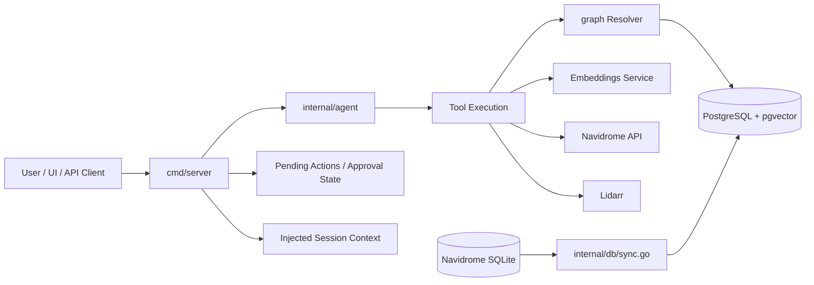
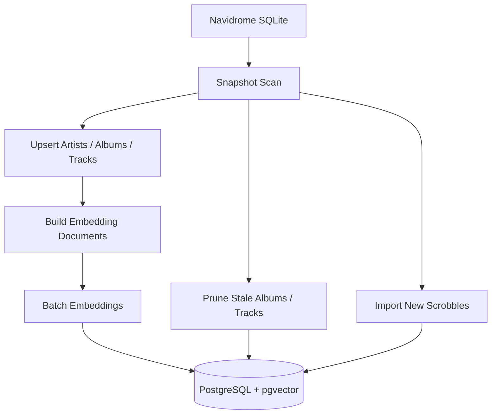

# Groovarr Architecture

## Overview

Groovarr is a tool-using chat service for a personal music library. It combines:
- a chat agent that decides between direct replies, tool calls, and clarifying questions
- a PostgreSQL + pgvector store for library metadata, embeddings, and play history
- periodic sync from Navidrome SQLite
- server-managed preview/approval workflows for state-changing operations

Core design goals:
- LLM-first intent handling for normal chat requests
- explicit and safe tool execution
- compact, library-grounded responses
- low operational overhead on small self-hosted machines

## System Diagram



## Runtime Components

### 1. API + Chat Server (`cmd/server`)

The server exposes:
- `/api/chat`
- `/api/chat/models`
- `/api/health`
- `/graphql`
- a minimal web UI for manual testing

The server owns:
- HTTP request handling
- session context injection
- pending-action registration, approval, and discard
- deterministic workflow state for previews and apply flows
- tool execution dispatch

Current file ownership inside `cmd/server`:
- `chat_normalizer.go`
  - normalized-turn parser contract and session grounding
- `chat_planner.go`
  - planner/router contract ahead of the responder
- `server_normalized_routes.go`
  - normalized-first server route execution
- `ORCHESTRATION.md`
  - staged chat contract, field ownership, and contract-expansion rules
- `../CHAT_EXECUTION_DIRECTION.md`
  - forward direction for model-led interpretation, audit/repair, and minimal deterministic routing
- `server_playlists.go`
  - saved-playlist reads, follow-ups, append flow, and playlist-availability follow-ups
- `server_discovery.go`
  - deterministic discovery, discovered-album follow-ups, semantic library album heuristics, and artist-removal preview routing
- `server_stats.go`
  - deterministic stats and facet routes plus their parsing helpers
- `server_listening.go`
  - recent-listening summary route and listening-window helpers
- `server_workflows.go`
  - preview/apply workflow orchestration
- `server_workflow_cache.go`
  - workflow dedupe/cache helper
- `server_route_helpers.go`
  - shared route-formatting and ownership-cue helpers
- `approvals.go`
  - pending-action state and request scoping
- `llm_context.go`
  - session context injection for pending actions and discovered/planned playlist state

### 2. Agent Loop (`internal/agent`)

The agent uses a strict JSON contract:
- `{"action":"query","tool":"<tool>","args":{...}}`
- `{"action":"respond","response":"..."}`

The agent is LLM-first for ordinary intent:
- derive intent from the latest message, chat history, and injected session context
- ask a concise clarifying question if the tool choice or required args are unclear
- use tools instead of model memory for library data, listening history, playlists, and workflow state

Current model defaults:
- Groq: `llama-3.3-70b-versatile`
- Hugging Face: `hf:openai/gpt-oss-120b:cerebras`

Tool visibility is driven by `internal/toolspec`, which provides:
- the prompt-visible tool catalog
- shared filter-key/schema metadata for important stats tools

### 3. Query Layer (`graph`, `internal/db/postgres.go`)

The resolver and DB layer provide:
- filtered artist, album, and track queries
- library facet counts
- listening summaries
- semantic album and track search
- similarity queries
- playlist state queries

This layer is responsible for DB-backed retrieval semantics, not chat behavior.

### 4. Sync + Enrichment (`internal/db/sync.go`)

Navidrome SQLite is the source of truth for library metadata and scrobble history.

The sync layer:
- pages through artists, albums, and tracks
- upserts current Navidrome state into Postgres
- prunes stale album and track rows that no longer exist upstream
- imports scrobble events incrementally
- regenerates embeddings when the embedding document version changes

Album embedding documents currently include:
- core album metadata
- MusicBrainz genres and tags when available
- Last.fm tags when available

### 5. Storage

Primary storage is PostgreSQL 16 with pgvector.

Important stored data:
- `artists`
- `albums`
- `tracks`
- `play_events`
- `sync_metadata`

Embeddings are stored with versioned embedding documents so sync can trigger targeted re-embedding when the document shape changes.

## Data Flow

1. Navidrome SQLite is read as the upstream source of truth.
2. Sync copies the current library snapshot into Postgres and prunes stale rows.
3. Sync imports new scrobbles into `play_events`.
4. The server normalizes the user turn, resolves session context, and plans the execution path.
5. The agent receives user input plus recent chat history, injected session context, and structured turn signals when the planner selects the agent path.
6. The agent returns either:
   - a direct response
   - a tool call
   - a clarifying question
7. The server executes allowed tools and feeds compact JSON results back into the agent loop.
8. For state-changing operations, the server creates a preview and a pending action instead of allowing direct mutation from the agent.

## Chat Request Flow

```mermaid
sequenceDiagram
    participant U as User
    participant S as cmd/server
    participant N as Normalizer + Planner
    participant A as internal/agent
    participant T as Tool Runtime
    participant DB as Postgres/Resolver

    U->>S: POST /api/chat
    S->>S: inject history + session context
    S->>N: normalize + resolve context + plan

    alt planner clarification
        N-->>S: clarification prompt
        S-->>U: chat response
    else deterministic route
        N-->>S: deterministic route
        S->>T: execute stable server route
        T->>DB: query library/listening data
        DB-->>T: compact result
        T-->>S: route result
        S-->>U: chat response
    else agent path
        N-->>S: agent route + structured turn signals
        S->>A: user message + history + context + signals
    alt direct response
        A-->>S: {"action":"respond","response":"..."}
        S-->>U: chat response
    else tool query
        A-->>S: {"action":"query","tool":"...","args":{...}}
        S->>T: execute allowed tool
        T->>DB: query library/listening data
        DB-->>T: compact result
        T-->>A: tool result JSON
        A-->>S: {"action":"respond","response":"..."}
        S-->>U: chat response
    else preview-first mutation
        A-->>S: preview tool request
        S->>S: register pending action
        S-->>U: preview response + pendingAction
    end
```

## Sync Flow



## Tooling Model

The runtime tool registry includes library/query tools such as:
- `libraryStats`
- `artists`
- `albums`
- `tracks`
- `artistListeningStats`
- `artistLibraryStats`
- `albumLibraryStats`
- `albumRelationshipStats`
- `libraryFacetCounts`
- `recentListeningSummary`
- `semanticAlbumSearch`
- `semanticTrackSearch`
- `similarArtists`
- `similarAlbums`

It also includes workflow-oriented tools such as:
- `discoverAlbums`
- `matchDiscoveredAlbumsInLidarr`
- `lidarrCleanupCandidates`
- `planDiscoverPlaylist`
- `resolvePlaylistTracks`
- `navidromePlaylists`
- `navidromePlaylist`
- `navidromePlaylistState`
- playlist mutation helpers

Direct destructive/apply tools are not exposed to the agent for normal use when a preview-first server flow exists. The server keeps ownership of those approval paths.

## Behavioral Boundaries

### LLM-owned
- ordinary intent understanding
- follow-up interpretation using recent chat history
- deciding between direct answer, tool call, or clarification
- wording of natural-language responses

### Server-owned
- pending-action lifecycle
- request-scoped preview attachment
- session context injection
- approval/discard execution
- tool execution and validation
- workflow dedupe

## Resource-Safety Design

Runtime limits are still important:
- sync cadence and batch sizes are configurable
- embedding calls are batched and paced
- agent iteration and token caps are enforced
- chat payload and history are bounded
- HTTP timeouts are configured

This keeps the service usable on modest self-hosted hardware.

## Extensibility Guidelines

When adding a new capability:
- prefer extending an existing domain file in `cmd/server` before growing `routing.go`
- define explicit arg schema and hard limits for new tools
- keep tool responses compact
- preserve preview-first behavior for state-changing operations
- update `internal/toolspec` and validation metadata together
- update `README.md` and this document when runtime behavior or ownership boundaries change
