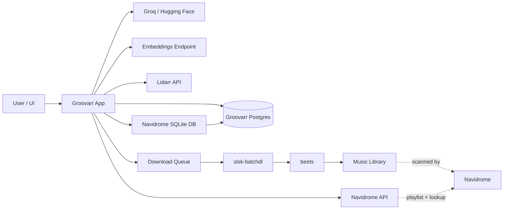
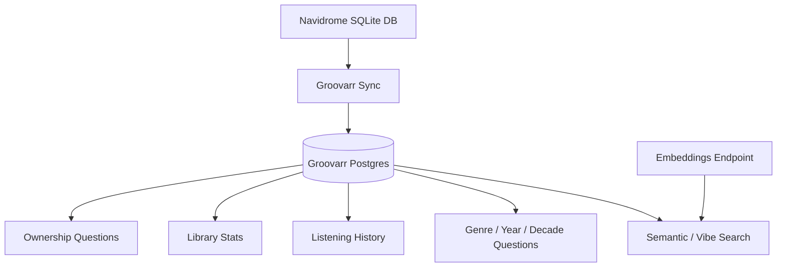
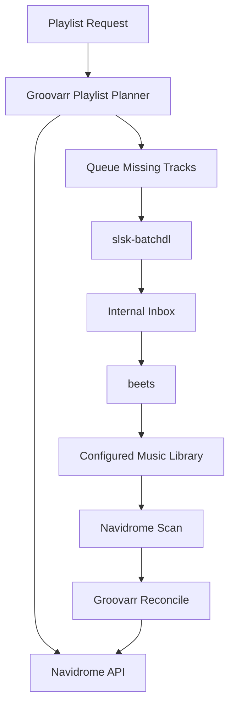

# Groovarr Dependency Map

This document describes which external systems and internal services each Groovarr feature depends on today.

It is based on the current source, not the intended future architecture.

## Quick Corrections

- `Lidarr` is not required for library ownership questions.
- `NAVIDROME_DB_PATH` is not only for listening history. It is the source for the synced library snapshot.
- `Navidrome API` is primarily for playlist operations and live track lookup.
- `EMBEDDINGS_ENDPOINT` is required for semantic and vibe-style library search, not for all recommendation flows.

## Dependency Summary

| Dependency | Required For | Not Required For |
| --- | --- | --- |
| `Groovarr Postgres` | Almost all user-facing reads and workflow state | Nothing meaningful; this is a core dependency |
| `Navidrome DB` | Library snapshot, ownership, library stats, listening history, play events | Playlist CRUD itself |
| `Navidrome API` | Playlist list/read/create/update, live track lookup, reconcile | Library ownership and listening stats |
| `Groq` or `Hugging Face` | Chat generation, album discovery, tool planning | Pure DB sync |
| `Groq` specifically | Playlist planning today | Basic chat if Hugging Face is configured |
| `Embeddings service` | Semantic album search, semantic track search, vibe/mood library questions | Exact library counts, ownership, ordinary playlist reads |
| `Lidarr` | Lidarr discovery, add/monitor flows, cleanup, artist removal | Library ownership, listening history, playlist reads |
| `Last.fm API` | Optional album enrichment and better semantic context | Core operation |
| `MusicBrainz API` | Optional album enrichment | Core operation |
| `slsk-batchdl` + Soulseek creds | Downloading missing tracks from playlist/discovery workflows | Read-only chat and stats |
| `beets` | Importing downloaded files into the library | Read-only chat and stats |

## System Diagram

## Core Read Paths

## Playlist and Download Path

## Dependency by Feature

### Core app runtime

- `Groovarr Postgres` is required.
- One LLM provider is required for conversational behavior.
- `Navidrome DB` is required if you want the sync daemon and snapshot-backed answers.

### Library ownership questions

Examples:

- "Do I own this album?"
- "Is this artist in my library?"
- "How many Radiohead albums do I have?"

Required:

- `Groovarr Postgres`
- `Navidrome DB` sync

Not used live at answer time:

- `Lidarr`
- `Navidrome API`
- `Embeddings`

### Library stats and facet questions

Examples:

- "What genres dominate my library?"
- "What decade do I own the most from?"
- "How many albums do I have?"

Required:

- `Groovarr Postgres`
- `Navidrome DB` sync

Not required:

- `Lidarr`
- `Navidrome API`
- `Embeddings`

### Listening history and listening stats

Examples:

- "What did I listen to last week?"
- "Who were my top artists this month?"

Required:

- `Groovarr Postgres`
- `Navidrome DB` sync from Navidrome `scrobbles`

Not required:

- `Lidarr`
- `Navidrome API`
- `Embeddings`

### Playlist read and write flows

Examples:

- list playlists
- read tracks in a playlist
- create a playlist
- append tracks
- remove tracks

Required:

- `Navidrome API`

Usually also involved:

- `Groovarr Postgres` for planning context and pending state
- one LLM provider for natural-language planning

Not required for pure playlist CRUD:

- `Lidarr`
- `Navidrome DB`
- `Embeddings`

### Playlist planning

Examples:

- "Make me a coding flow playlist"
- "Add five melancholy jazz tracks"

Required today:

- `Groq`
- `Navidrome API`
- `Groovarr Postgres`

Optional depending on whether new tracks are missing:

- `slsk-batchdl`
- `beets`

Notes:

- Playlist planning is still `Groq`-specific today.
- If all chosen tracks already exist in Navidrome, the downloader/import pipeline is not needed.

### Semantic and vibe-style library search

Examples:

- "What in my library feels nocturnal and spacious?"
- "Find albums like late-night rainy city jazz"

Required:

- `Embeddings service`
- `Groovarr Postgres`
- `Navidrome DB` sync, because the searchable library lives in Groovarr Postgres

Optional quality improvements:

- `Last.fm API`
- `MusicBrainz API`

Not required:

- `Lidarr`
- `Navidrome API`

### Global album discovery and recommendation

Examples:

- "Recommend five ambient albums for coding"
- "What should I hear if I like Massive Attack and Portishead?"

Required:

- one LLM provider

Optional:

- `Lidarr` if you want the discovered albums matched against Lidarr afterward

Not required:

- `Embeddings`
- `Navidrome API`
- `Navidrome DB`

### Lidarr discovery and add flows

Examples:

- match discovered albums in Lidarr
- add discovered artists/albums to Lidarr
- monitor albums
- remove artist from library through Lidarr workflow
- Lidarr cleanup candidates

Required:

- `Lidarr`

Also commonly involved:

- one LLM provider for discovery/planning
- `Groovarr Postgres` for local context and previews

Sometimes required:

- `LIDARR_ROOT_FOLDER_PATH` for reliable add flows, unless Lidarr root-folder discovery succeeds

Not required:

- `Navidrome API`
- `Embeddings`

### Download and import pipeline

Examples:

- missing tracks from a created playlist
- tracks queued for later reconciliation

Required:

- `slsk-batchdl`
- Soulseek credentials
- `beets`
- `Navidrome API` for final playlist reconcile

Also required in practice:

- Navidrome scanning the imported files

Not required:

- `Lidarr`

## Dependency by Tool/Subsystem

### Groovarr Postgres

Used by:

- artists/albums/tracks queries
- library stats
- listening stats
- semantic search result retrieval
- pending approvals and workflow state
- reconcile state

### Navidrome DB

Used by sync to ingest:

- artists
- albums
- tracks
- play events from `scrobbles`

This is the source of truth for Groovarr's snapshot-backed library understanding.

### Navidrome API

Used for:

- playlist list/read
- playlist create/update/remove
- finding a live song ID by artist/title
- reconciling downloaded tracks back into a playlist

### Lidarr

Used for:

- searching artists/albums in Lidarr
- adding artists
- monitoring albums
- removing artists
- cleanup workflows

It is not used to answer "is this in my library?" style questions.

### Embeddings

Used for:

- turning free-text mood/vibe queries into embeddings
- semantic nearest-neighbor search over embedded albums and tracks
- sync-time embedding generation for albums, artists, and tracks

If embeddings are missing, Groovarr still runs, but semantic/vibe flows degrade or become unavailable.

### Last.fm

Used only during sync-time album enrichment when enabled.

Current uses:

- album tags
- summary
- popularity signals

Those enrich the album document used for semantic search and explanation quality.

### MusicBrainz

Used only during sync-time album enrichment when enabled.

Current uses:

- supplemental album metadata

### Downloader and importer

`slsk-batchdl` is used to fetch missing tracks.

`beets` is used to import those tracks into the configured music library.

These are only needed when Groovarr is asked to go beyond the current library.

## Practical Operator View

If someone has only:

- `Navidrome DB`
- `Groovarr Postgres`
- one LLM provider

They can still use:

- ownership questions
- library stats
- listening history
- basic chat
- global recommendations

If they add:

- `Navidrome API`

They also get:

- playlist list/read/write
- playlist reconcile

If they add:

- `Embeddings`

They also get:

- semantic album search
- semantic track search
- vibe and mood-style library questions

If they add:

- `Lidarr`

They also get:

- Lidarr discovery/match/add/remove/cleanup workflows

If they add:

- `slsk-batchdl`
- Soulseek credentials
- `beets`

They also get:

- missing-track acquisition and import after playlist creation

## Bottom Line

The most important current dependency split is:

- `Navidrome DB` powers Groovarr's library and listening snapshot
- `Navidrome API` powers playlists and live track resolution
- `Lidarr` powers Lidarr-only workflows
- `Embeddings` power semantic and vibe-style library search
- `Last.fm` and `MusicBrainz` are optional enrichment
- `slsk-batchdl` and `beets` only matter when Groovarr needs to acquire tracks that are not already in the library
